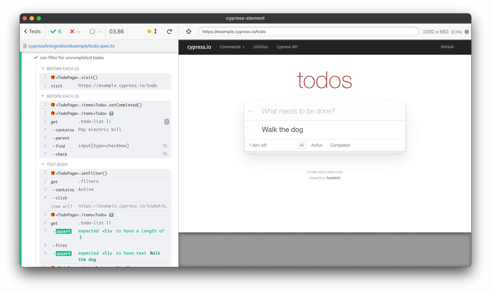

# 🎁 cypress-element


[](https://opensource.org/licenses/MIT)
[](http://www.typescriptlang.org/)
[](https://www.npmjs.com/package/cypress-element)

Composition api for [cypress](https://cypress.io)

`cypress-element` – Simple, Composable, Customisable, Reusable, Friendly for developer library written on TypeScript for writing tests on Cypress



### Main concept

- ✨**Simple**: Everything is an element
- 🌳**Composable**: element can be organized by composition of elements hierarchy
- 🛠**Customisable**: You can create own elements
- ⏳**Reusable**: You can save elements hierarchy
- ✌**Friendly**: TypeScript first, autocomplete, auto type

## Installing

```shell
npm i -D cypress-element
# or
yarn add -D cypress-element
```

## Usage

`cypress-element` extends Cypress' `cy` command.

Add this line to your project's `cypress/support/commands.js`:

```javascript
import "cypress-element/lib/commands";
```

Then, in your test, you can write

```typescript
import { el } from "cypress-element";
// or
// import el from 'cypress-element';

// ...

const page = el("div", {
  button: el("button"),
});

it("test", () => {
  page.visit("/test.html");
  page.button.click();
});
```

## Documentation

Read more in [documentation](https://dragorww.github.io/cypress-element/#/docs);

### Motivation

Today real app usually work on one of frameworks: React, Vue, Agular. All popular frontend framework base on two concepts: composition structures and idea of everything is a component.
We can use same ideas in tests for real app, and take benefits of this.

### Examples

You found examples of usage in [test folder](./cypress/integration/example)
